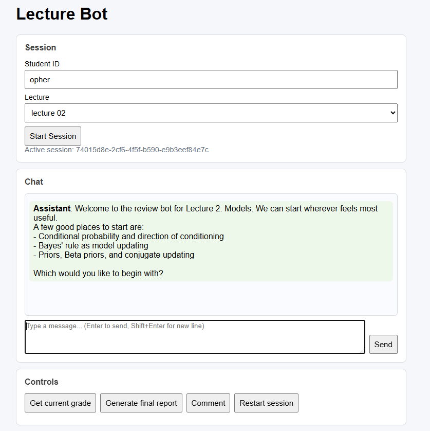
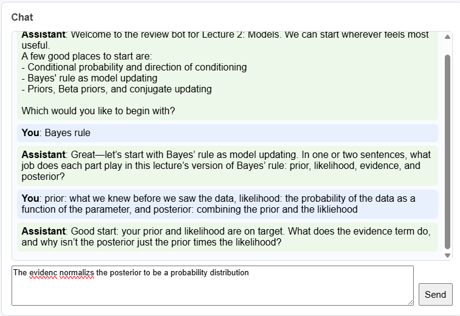
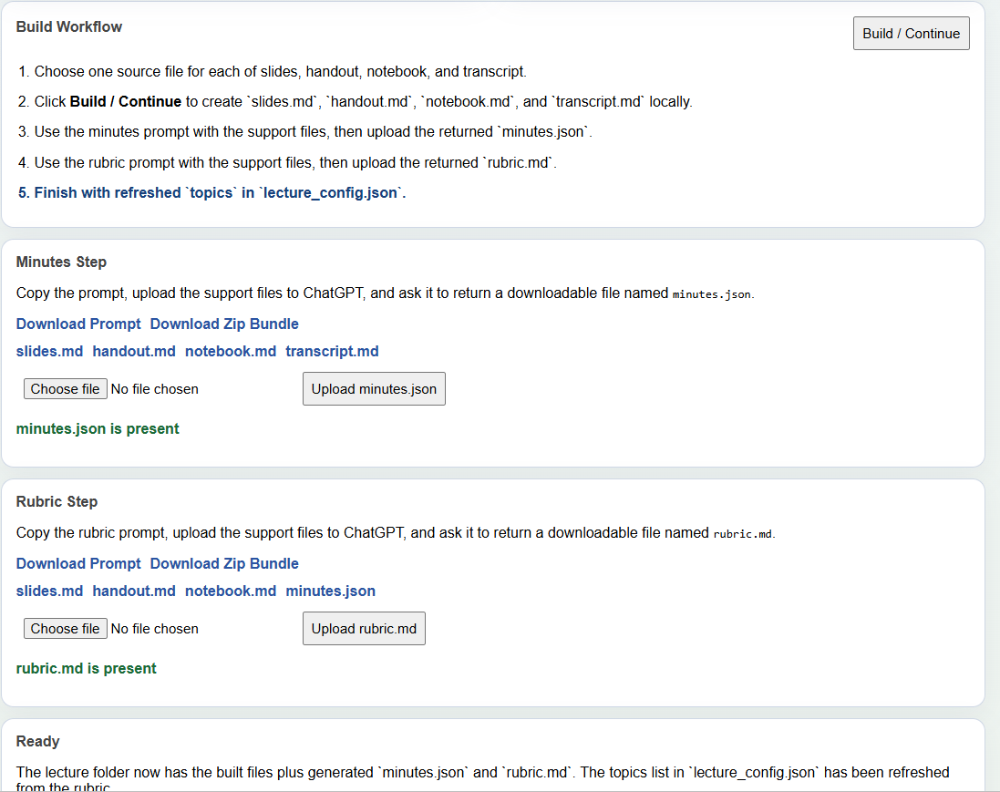
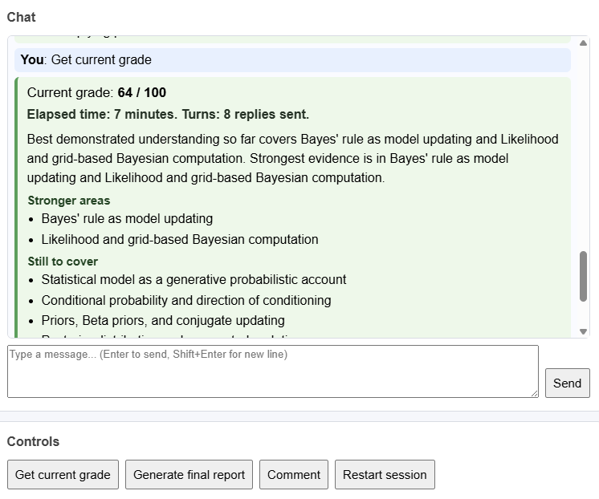
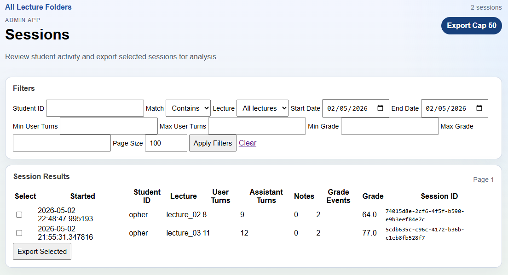
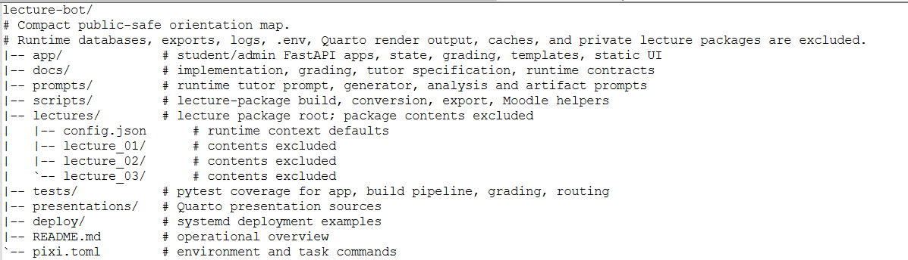

## From Lecture Materials to a Lecture-Specific AI Tutor {.title-slide}

<p class="subtitle">A workflow for turning ordinary course materials into short, guided, graded review sessions.</p>

<p class="presenter-line">Presenter: [name] · Date: [date]</p>

::: {.notes}
Timing: 0:20.

Open by saying this is not a generic chatbot demo. It is a workflow for creating, running, inspecting, and improving lecture-specific tutoring interactions. The through-line is lecturer-authored structure: what was taught, what matters, what counts as understanding, and what evidence should be looked for.
:::

## What Students Experience

:::: {.two-col-wide-left}
::: {.screenshot-frame}
{.screenshot .screenshot-tall}
:::

::: {.compact}
- The student enters **Student ID**, chooses **Lecture**, and clicks **Start Session**.
- The app opens a short chat-based review session.
- Students can use **Get current grade** or **Generate final report**.
- The **Comment** control records a note without changing the tutoring turn.
- The visible UI is deliberately simple: session, chat, controls.
:::
::::

::: {.callout}
Not a generic chatbot. Not a conventional quiz UI. A focused lecture-review interaction.
:::

::: {.notes}
Timing: 0:50.

Use repo-accurate UI language from `app/templates/chat.html`: Student ID, Lecture, Start Session, Chat, Send, Get current grade, Generate final report, Comment, and Restart session. The frontend calls `/lectures`, `/start_session`, `/send_message`, `/get_grade`, `/generate_report`, `/submit_note`, and `/restart_session`.

Emphasize that the simplicity is intentional. Students do not see the lecture package, rubric internals, state sanitizer, private artifacts, or grading arithmetic. They experience a short exchange that feels closer to office-hours review than to a multiple-choice quiz.
:::

## How a Student Session Works

:::: {.two-col-wide-left}
::: {.screenshot-frame}
{.screenshot .screenshot-short}
:::

::: {.diagram-side}
```{mermaid}
flowchart TD
    A([Start session]) --> B[Lecture package<br/>+ sampled topics]
    B --> C[Focused tutor dialogue]
    C --> D[Session state<br/>mastery + evidence notes]
    D --> E[Current grade<br/>or final report]
    D -. next turn .-> C
    C --> F[(Messages + audits<br/>+ private artifacts)]
```
:::
::::

::: {.notes}
Timing: 1:00.

The key point is persistent state. `session_manager.py` creates `topics_sampled`, `topics_covered`, `mastery`, `best_mastery`, `evidence_notes`, `current_grade`, timeout flags, and turn count. A session is not stateless chat: each turn can add evidence, and the backend persists messages, session state, audit rows, and private artifact logs when a private artifact schema is active.

The control actions are separate from ordinary dialogue. `/get_grade` returns a current backend-computed grade. `/generate_report` uses the same authoritative grade snapshot and asks the report path for prose, with a local fallback.
:::

## How the Lecturer Creates the Tutor Content

:::: {.two-col-wide-right}
::: {.workflow-stack}
<div class="workflow-row">
  <div class="workflow-box source">transcript</div>
  <div class="workflow-arrow">→</div>
  <div class="workflow-box">minutes prompt</div>
  <div class="workflow-arrow">→</div>
  <div class="workflow-box output">minutes.json</div>
</div>

<div class="workflow-row">
  <div class="workflow-box source">slides<br/>handout<br/>minutes</div>
  <div class="workflow-arrow">→</div>
  <div class="workflow-box">rubric prompt</div>
  <div class="workflow-arrow">→</div>
  <div class="workflow-box output">rubric.md</div>
</div>

<div class="workflow-row">
  <div class="workflow-box source">slides<br/>handout<br/>minutes<br/>rubric</div>
  <div class="workflow-plus">+</div>
  <div class="workflow-box source">tutor specification<br/>backend contract</div>
  <div class="workflow-arrow">→</div>
  <div class="workflow-box output">runtime tutor prompt<br/>private artifact schema</div>
</div>
:::

::: {.screenshot-frame}
{.screenshot .screenshot-wide}
:::
::::

::: {.callout}
The lecturer is not merely uploading files. The lecturer packages the intellectual structure of the lecture.
:::

::: {.notes}
Timing: 1:40.

This is the center of the talk. The repo supports two flows: copying in a complete lecture package, or using the admin app to create a folder, upload/select sources, build local markdown artifacts, download manual prompts/bundles, and upload generated `minutes.json` and `rubric.md`.

Runtime requires `lecture_config.json` and `rubric.md`, plus context files from `lectures/config.json`: required `slides.md`, `handout.md`, `minutes.json`, and optional `bot_notes.md`. The build/admin workflow also handles `notebook.md` and `transcript.md` as support artifacts. `rubric.md` supplies topic definitions, and rubric headings refresh `topics` in `lecture_config.json`.

Say plainly: the package tells the tutor what was taught, what matters, what counts as understanding, and what evidence should be looked for. This is the lecturer’s educational labor made operational.
:::

## The Pedagogical Idea

::: {.statement}
“The lecturer defines the target understanding; the tutor probes whether the student is carrying that understanding.”
:::

:::: {.two-col}
::: {.split-card}
<p class="card-title">What It Avoids</p>

- Generic AI help
- Recognition-first quiz evidence
- Treating polished prose as mastery
:::

::: {.split-card}
<p class="card-title">What It Tries To Create</p>

- Short-answer conceptual dialogue
- Productive handling of partial answers
- Probes for student-owned understanding
:::
::::

::: {.notes}
Timing: 1:05.

The tutor specification calls it a focused, lecture-grounded, Socratic-but-pragmatic educational dialogue partner. The goal is to feel like teaching, not testing. Evaluation exists to serve learning and grade defensibility.

The tutor is designed to ask for criteria, distinctions, explanations, transfer, practical interpretation, and independent correction. This matters in an AI-rich environment: a fluent answer is not automatically strong evidence, so the tutor asks the student to operate on the idea.
:::

## How Grading Works {.grading-slide}

:::: {.grading-fit}
::: {.grading-left}
::: {.screenshot-frame .grading-screenshot}
{.screenshot .screenshot-grade}
:::

<div class="grading-goal">Grade means “what has been demonstrated so far,” not merely completion. The final report is submitted to Moodle and checked against backend records.</div>
:::

::: {.grading-right}
::: {.grading-bullets}
- Tutor evaluates mastery in each topic.
- Backend combines topic scores for a grade.
- Diminishing returns for mastery.
- Diminishing returns for breadth.
- Overall goal: reasonable understanding of most of the lecture.
- Student uploads the final report for credit; it is validated against backend logs.
:::

<div class="grading-details">
<div class="grading-panel">
<div class="grading-panel-title">Actual Mastery Levels</div>
<div class="mastery-grid">
<div><strong>45</strong><span>Anchored foothold</span></div>
<div><strong>70</strong><span>Clearer grasp</span></div>
<div><strong>84</strong><span>Student-owned explanation</span></div>
<div><strong>92</strong><span>Fresh check or guided transfer</span></div>
<div><strong>96</strong><span>Robust independent use</span></div>
<div><strong>98-100</strong><span>High confidence, transfer, near-complete command</span></div>
</div>
</div>

<div class="grading-panel">
<div class="grading-panel-title">Breadth Weighting Across Ranked Topics</div>
<div class="breadth-row">
<div><strong>55%</strong><span>Best</span></div>
<div><strong>25%</strong><span>Second</span></div>
<div><strong>13%</strong><span>Third</span></div>
<div><strong>7%</strong><span>Fourth</span></div>
</div>
</div>
</div>
:::
::::

::: {.notes}
Timing: 1:05.

This is implemented behavior, not just a design intention. `app.bot_engine.compute_weighted_grade()` uses `[55, 25, 13, 7]`, and `/get_grade` and `/generate_report` do not ask the model to compute the final numeric grade.

The tutor can propose per-topic `mastery` and `evidence_notes` in a sparse state update. The backend filters to canonical topic IDs, clamps mastery to 0-100, maintains `best_mastery`, ranks topics by best demonstrated score, floors the weighted sum, and records grade/report snapshots in `grade_events`.

The report text is OpenAI-backed, but the report prose receives an authoritative backend grade snapshot. If report generation fails, the backend uses local fallback prose and preserves the grade.

The student-facing UI adds a **Download report** button and tells the student to upload that file to Moodle. `scripts/grade_moodle.py` parses the Moodle ZIP, checks the report header and fields, validates `session_id`, `student_id`, lecture, grade, and deadline against the session database, and emits the Moodle grade CSV. `grade_events` preserves backend grade/report snapshots for inspection and export.
:::

## What the Backend Protects

::: {.statement}
“The LLM is not the system. The system is the wrapper: lecture package, prompt contract, state, schemas, grading logic, logs, and runtime boundaries.”
:::

:::: {.backend-grid}
::: {.split-card}
<p class="card-title">LLM Does</p>

- tutoring replies
- answer interpretation
- sparse `mastery` and `evidence_notes`
- report prose from a backend grade snapshot
:::

::: {.split-card}
<p class="card-title">Backend Owns</p>

- session identity, timeout, and persistence
- lecture package loading and topic sampling
- canonical topic IDs and state sanitization
- private artifact schema validation and logs
- weighted grade computation and export boundaries
:::
::::

::: {.notes}
Timing: 1:05.

This is where governance and inspectability live. The model is one component inside a conventional web application.

The backend owns session identity, lecture loading, topic sampling, canonical topic IDs, timeout lifecycle, language policy, sparse-state merge, private artifact validation, persistence, grade computation, grade events, and export boundaries. Runtime/private files are explicitly separated in the README: `.env`, SQLite databases, logs, exports, rosters, uploaded lecture source files, and private lecture packages should not be committed or exposed.
:::

## How We Improve the Tutor from Real Conversations

::: {.statement}
“We are not only evaluating students. We are also evaluating the tutor.”
:::

:::: {.two-col-wide-right}
::: {.loop-stack}
<div class="loop-step"><strong>1. Run sessions</strong><br/>Students use the lecture-specific tutor.</div>
<div class="loop-arrow">↓</div>
<div class="loop-step"><strong>2. Export evidence</strong><br/>Transcripts, state, audits, private artifacts, notes, and grade events.</div>
<div class="loop-arrow">↓</div>
<div class="loop-step"><strong>3. Analyze behavior</strong><br/>Use `prompts/log_analysis_prompt.md` to find concrete tutor failures.</div>
<div class="loop-arrow">↓</div>
<div class="loop-step"><strong>4. Regenerate</strong><br/>Revise the tutor specification, then regenerate the runtime prompt and schema.</div>
:::

::: {.screenshot-frame}
{.screenshot .screenshot-wide}
:::
::::

::: {.notes}
Timing: 1:20.

The repository includes this improvement workflow in the admin app, scripts, and prompts. The admin app exposes `/sessions` for filtering tutoring sessions and `/sessions/export` for downloading selected sessions. `scripts/export_session_package.py` exports a rich single-session package, and `scripts/export_investigation_package.py` supports multi-session handoff packages.

Exports include transcripts, session metadata/state, dialogue audits, private artifact logs when present, session notes, grade events, prompts, schemas, contracts, and lecture context. `prompts/log_analysis_prompt.md` defines a staged analysis workflow: first inspect behavior from the transcript, then compare to prompt behavior, check diagnostics/private artifacts, review the tutor specification, revise it, and check it against the tutor specification contract.

Close the slide by saying: the revised specification can feed `prompts/tutor_generator_prompt.md`, which regenerates the runtime tutor prompt and private artifact schema only after contract checks pass.
:::

## Why We Built It

- Students need more conceptual practice than lectures and homework alone can provide.
- Instructors need scalable formative review.
- Generic AI help is not course-aligned.
- Standard LMS quizzes are often too rigid for conceptual understanding.

::: {.callout}
This is the middle path: structured, lecture-specific, short, inspectable dialogue.
:::

::: {.notes}
Timing: 0:45.

This slide should synthesize, not restart the talk. The need is ordinary: students benefit from more opportunities to explain, distinguish, and apply ideas. The constraint is also ordinary: instructors cannot personally run short conceptual interviews with every student after every lecture.

The system tries to make that middle space practical without surrendering alignment, evidence, or inspectability.
:::

## Why This Matters for Educational Technology Support

1. Lecturer-authored structure keeps the tutor aligned.
2. Backend-owned state and grading make the system inspectable.
3. Conversation analysis creates a practical improvement loop.
4. The same pattern can be reused across lectures and courses.

::: {.statement}
“The question is not whether students can chat with AI. They already can. The question is whether we can help lecturers turn their own course materials into bounded, inspectable, pedagogically useful AI interactions.”
:::

::: {.notes}
Timing: 0:50.

End with the reusable pattern. This is not just one bot for one course. It is a repeatable educational-technology workflow: lecturer-authored structure, a focused student experience, backend-governed state and grading, and structured analysis of real conversations to improve the tutor.

For support staff, the implication is that the valuable service is not “add AI.” It is helping lecturers package course-specific meaning into a bounded system that can be inspected, improved, and reused.
:::

## Backup: Repo Orientation {.smaller}

::: {.screenshot-frame}
{.screenshot .screenshot-wide}
:::

::: {.notes}
Use only if someone asks where the pieces live. This compact map is generated by `generated/make_repo_tree.py`; it shows lecture package directory names but excludes `.env`, databases, exports, logs, Quarto render output, caches, and private lecture-package contents.
:::
